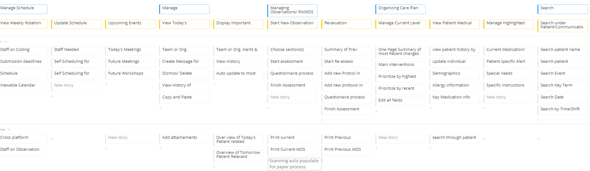

# Inter-care
RAIMDS is an international standard for comprehensive assessment and care planning used in nursing homes. Current processes and existing interfaces are areas that can be improved on. For our Systems Analysis and Design Class, my partner and I created a new user interface targeted at nurse stakeholders to improve the user experience. Concetrating on centralizing relevant patient data, expediating the asssessment process, and improving communications on patient care. 

Milestone I is a summary of our initial discussions and goals of improvement for the key stakeholder, having everyting from our earliest User story map of desired sections and capabilities of the platform which can be seen in the image above, to end-to-end scenarios and context diagrams of possible use among other stakeholders.

Following that, we storyboarded the process for which a Nurse practitioner may utilize the software, matching mock up directions to desired workflows.

The final mock up was completed through google slides and presented to through one of our chosen case scenarios. Additional functionality details and thoughts on the UX design can be seen seen in the UI mockup powerpoint.
